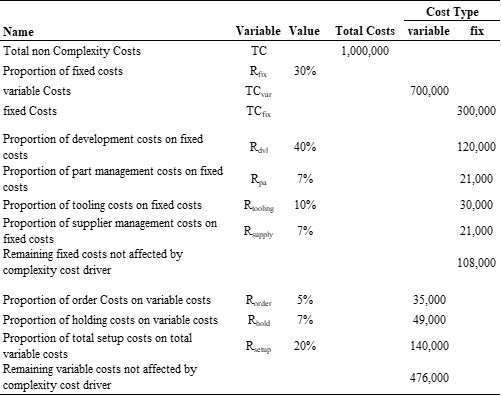

```{r, include = FALSE}
knitr::opts_chunk$set(
  collapse = TRUE,
  comment = "#>"
)
```

## Introduction

This documentation explains how to use this framework to run complexity cost experiments. The experiment follows the following procedure:

1.  For each EAD relevant parameter in the design of experiments table `DOE` generate an individual EAD.

2.  For each generated EAD scenarios of overdesign are created. For each overdesign step, two components are replaced by one oversized component. In doing so, the overdesign procedure changes the patterns in $DMM_{FD,PD}$ and $DSM_{PD}$ . For further details see: @Meerschmidt.2024. The procedure has two available methods which are briefly introduced in the following. The `method='random'` chooses a first component, randomly. The second component is selected by finding the nearest neighbor of component one by using the Euclidean distance.

    ```{r}
    library(EAD)
    set.seed(1234)
    EAD <- smallEAD
    for(i in 1:(NCOL(EAD$DMM$FD_PD) - 1)){
      EAD <- overdesign_EAD(EAD,bounds=c(1,1),method='random')[[1]]
      print(EAD$DMM$FD_PD)
    }

    ```

    The second `method='optimized'` works as follows:
    As a first component, the one with the smallest demand rate is chosen. The second component, is selected based on two criteria. First, the procedures searches if there is a component available which overfills the requirements. If this is the case, there are no additional costs since the component already exists. If there is no component which overfill the requirements of component one, the second component is selected by finding the nearest neighbor of component one by using the Euclidean distance.

    ```{r}
    set.seed(1234)
    EAD <- smallEAD
    for(i in 1:(NCOL(EAD$DMM$FD_PD) - 1)){
      EAD <- overdesign_EAD(EAD,bounds=c(1,1),method='optimized')[[1]]
      print(EAD$DMM$FD_PD)
    }
    ```

3.  Generate a variety scenario as described in `utils::vignette('pcs-experiment',package ='EAD')` .

4.  For each combination of EAD, overdesign and variety scenario, the complexity cost are calculated. The complexity cost drivers are explained in @Meerschmidt.2024 and packages' vignettes:

    ```{r include=TRUE, eval=FALSE}
    utils::vignette('productionCostEffects',package ='EAD')

    utils::vignette('developmentCostEffects',package ='EAD')
    ```

## Simulation

### Design of Experiments

In order to run the simulation, a design of experiment needs to be defined:

```{r setup}
library(EAD)
library(tidyr)

set.seed(1243)

DOE<-expand_grid(N_FR = list(c(5)), # number of functional requirements
                 N_DD = list(c(5)), # number of physical domain elements
                 N_PrD = list(c(10)), # number of process domain elements
                 N_RD = list(c(10)), # number of resource domain elements
                 DNS = list(c(0.05,0.2)),
                 method_FD = "DNS",
                 N_PROD=30, # number of products
                 prod_step_width = 30,  # introduce prod_step_width new products in each step
                 TOTAL_DEMAND = 1000, # total demand (average reuse ratio of 18)
                 Q_VAR = list(c(0,1.7)), # coefficient of variation for demand distribution
                 DMM_PAR = expand_grid(FD_PD=list(c(0,0.1)),
                                       PD_PrD=list(c(0,0.1)),
                                       PrD_RD=list(c(0,0))), # desired system design complexity
                 uB_DMM = 5,
                 allowZero = F,
                 ut_DMM = F, # if the upper triangle DMMs should be generated too (DMM_FD_PrD,DMM_FD_RD,DMM_PD_RD)
                 DSM_param=expand_grid(PD=list(c(0,0,0,1)),
                                       PrD=list(c(0,0.1,0,1)),
                                       RD=list(c(0,0,0,1))), # first two entries refer to the density of the DSMs and the second pair to the cv if the DSM_method='modular' is used.
                 DSM_method='modular',
                 ub_DSM = 5,
                 TC = 10^6, # total costs
                 r_in = list(c(0.1,0.5)),
                 r_fix = list(c(1,1)), # proportion of fixed costs on total indirect costs
                 RC_cv = list(c(0,3)), # coefficient of variation for resource cost distribution
                 bounds = list(c(0.1,1)), # bounds for the increase in material and development costs caused by overdesign
                 method_overdesign = "optimized", # method used for the overdesign
                 R_dvl = list(c(0.1,0.5)), # proportion of development costs
                 R_PA = list(c(0.05,0.2)), # proportion of part administration costs
                 R_order = list(c(0.05,0.2)), # total order costs
                 R_hold = list(c(0.05,0.2)), # total holding costs
                 R_setup = list(c(0.05,0.5)), # total setup costs 5%-50%
                 R_tooling = list(c(0.05,0.2)), # proportion of tooling costs on total fixed costs
                 R_supply = list(c(0.05,0.2)), # proportion of supplier, search, acquisition and management costs on total fixed costs
                 N_RUN = 1:4 # number of runs
)
```

The variables $R_{dvl}$, $R_{PA}$, $R_{order}$, $R_{hold}$, $R_{setup}$ and $R_{tooling}$ are the proportions of development, part administration, order, holding, setup and tooling costs for the EAD with no overdesign and under the full variety setting. The following table provides an overview on ratios' definition.

{width="5in"}

### Numerical Experiment

The numerical experiment is started by calling:

```{r include=TRUE, eval=FALSE}
res <- simulate_costEffects_MC(DOE,
                               NUMB_CORES=4,
                               ehNodes = "remove")
```

```{r include=FALSE, eval=TRUE}
res <- simulate_costEffects_MC(DOE,
                               NUMB_CORES=4,
                               ehNodes = "remove")
```

## References
