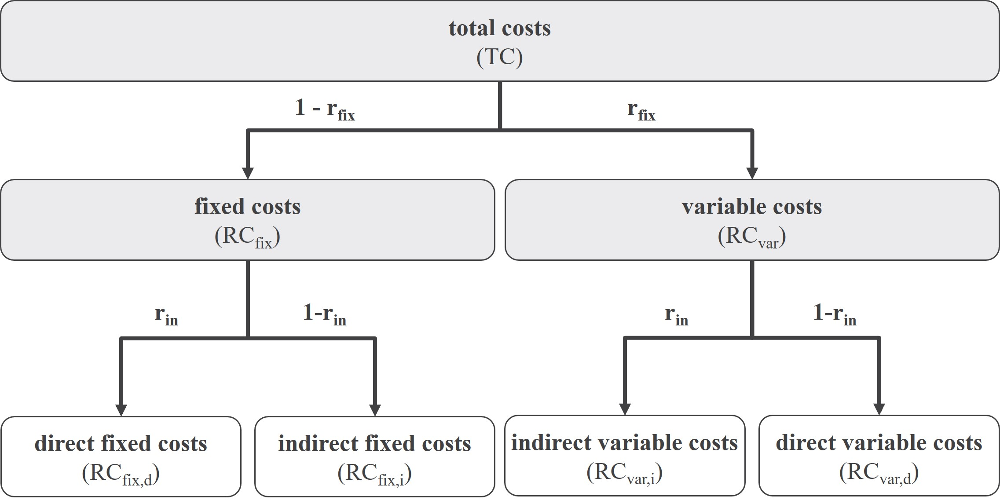

```{r, include = FALSE}
knitr::opts_chunk$set(
  collapse = TRUE,
  warning = FALSE,
  message = FALSE,
  comment = "#>"
)
options(rmarkdown.html_vignette.check_title = FALSE)
```

## EAD Creation Process

The function `crt_EAD` generates a EAD realization for each row in the design of experiments table. If you want to know how to use this function, please have a look in packages readme file. The following graph shows the control flow chart for this function.

{width="200"}

Before we go through the code step-by-step we load the library and set the seed.

```{r, include=T}
library(EAD)
set.seed(1234)
```

## 1.1 Create Product Mix

### Input

+----------+----------------------------------------------------------------------------------------------+-----------------------------------------------------------------------------------------------+------------------------------------------------------------------------------------------+
| Variable | Description                                                                                  | low values                                                                                    | high values                                                                              |
+==========+==============================================================================================+===============================================================================================+==========================================================================================+
| PARAM    | Parameter which is used differently across individual method~PM~.\                           | `method="random"`: small product mix.                                                         | `method="random"`: product mix is larger as many products are selected.\                 |
|          | `method="random"`: defines the proportion of products within the product mix.\               |                                                                                               | `method="DNS"`: majority of products have many features selected (dense product matrix). |
|          | DSM~FD~. `method="DNS"`: defines the density of the later P~FD~ matrix.                      | `method="DNS"`: majority of products have only some features selected (sparse product matrix) |                                                                                          |
+----------+----------------------------------------------------------------------------------------------+-----------------------------------------------------------------------------------------------+------------------------------------------------------------------------------------------+
| method   | Method for generating the product mix. Depending on the method PARAM has different meanings. |                                                                                               |                                                                                          |
+----------+----------------------------------------------------------------------------------------------+-----------------------------------------------------------------------------------------------+------------------------------------------------------------------------------------------+
| N_FR     | Number of elements in the functional domain                                                  | Only a few functional requirements necessary to realize the product mix.                      | Many functional requirements necessary to realize the product mix.                       |
+----------+----------------------------------------------------------------------------------------------+-----------------------------------------------------------------------------------------------+------------------------------------------------------------------------------------------+

### Generation Process

The product mix is generated by three input parameters. The number of functional requirements (*N_FR*); the generation parameter (*PARAM*) where its interpretation depends on the creation method (*method*). In a first step, the power set of functional requirements is generated; and the empty product (all zeros) is excluded. This results in a binary matrix where for each product (rows) the functional requirements are defined (see equations (2.12) and (2.13)). In a second step, the free product mix is restricted using one of the following methods. The user can choose between the *"random", "combination"* and "*density"*. If *"combination"* is selected, the product mix is constrained by replacing *PARAM* percentage of entries in the product mix constraint matrix (DSM_FD) with a randomly generated constraint. The *"random"* method samples *PARAM* percentage of products randomly from the product mix. If"*density"* is chosen, products are selected in a way which ensures that the final product matrix (P_FD) shows a certain density (proportion of none-zero entries).

While the combination method refers to industrial procedure of restricting feature combinations, the *"density"* method allows to reproduce empirical observed product mixes. Finally, the *"random"* method has the advantage that the number of products can be directly influenced. This is important in cases where a fixed number of products is desired. Regardless the method, the procedure ensures, that each functional requirement is used at least ones (no zero columns).

### Examples

#### Method: Random

Let's assume that we have ten functional requirements `N_FR=10` and want to select p`rop_PROD=0.03` of the products randomly from the product mix under free combination.

```{r,include=T}
P_FD<-create_ProductMix(N_FR = 10,
                        prop_PROD = 0.03,
                        method = "random")

P_FD$P_FD_const # returns the constraint product matrix

P_FD$measures # returns the measures
```

#### Method: Density

A second method is the product selection in order that the final product mix has a certain density.

```{r,include=T}

P_FD<-create_ProductMix(N_FR = 15,
                        DNS = 0.2,
                        N_PROD = 17,
                        method = "DNS")

P_FD$P_FD_const # returns the constraint product matrix

P_FD$measures # returns the measures
```

## 1.2 Create Product Demand

### Input

| Variable | Description                                        | low values                                     | high values                                                                   |
|----------|----------------------------------------------------|------------------------------------------------|-------------------------------------------------------------------------------|
| DMD_cv   | Coefficient of variation for the demand vector.    | Sales are equally distributed across products. | Some products with a high share on sales and many products with low quantity. |
| TD       | Total number of sales for the created product mix. | Product mix with low number of total sales.    | Product mix with high number of total sales.                                  |

### Generation Process

Following the Anand model, product demand is assumed to be given exogenously. A product demand vector, therefore, varies in three dimensions. The number of products which are specified by the current product mix and generated in the previous step; the total demand (*TD*) defined as the number of units sold from the product mix; and distribution of sales across products (*DMD_cv*). Demand distribution can be influenced by an input coefficient of variation. The procedure generates vector of random integers which fulfills two criteria. First, the sum of entries must be equal the total demand and, second, the achieved coefficient of variation must lie between a ten percent interval of the supplied input value. Depending on the input parameters, for some combinations there exist no valid solution. In such cases, the procedure stops after ten iterations and the current vector which represents the nearest possible solution is returned.

### Example

Create a demand vector with 120 products, a total demand of 1000 units and a coefficient of variation of 2.

```{r, include=T}
DMD<-crt_DEMAND(n_PROD=50,TOTAL_DEMAND=1000,Q_VAR=1)

DMD$DEMAND # demand vector

DMD$CHECK # demand measures
```

## 2. Create Domains

The sub flowchart of the `crt_DOMAINS` function is shown below.

{width="200"}

The procedure is exemplary shown for one domain transition. Source domain elements are noted with the indices `src` and the target domain elements with the `tgt` indices. A domain transition consists of an inter-domain matrix $DMM_{src,tgt}$ as well as a dependency structure matrix ($DMM_{tgt}$) and is defined as:

$$
P_{tgt}=P_{src}*[(DMM_{src,tgt}*DSM_{tgt})+DMM_{src,tgt}]
$$

$P_{src}$ is the product representation in the source domain and $P_{tgt}$ in the target domain. The mapping between physical domain (PD) and process domain (PrD) as well as between PrD and resource domain (RD) are defined shown in the equation above. The mapping between functional domain (FD) and PD is an exception and is defined as:

$$
P_{PD}=max_{el}(P_{PD,1ij};P_{PD,2ij})
$$

Where $max_{el}$ is the element wise maximum of the two product matrices which are defined as:

$$
\begin{equation*}
P_{PD,1} = \begin{cases}
1 &P_{FD}*DMM_{FD,PD}>0\\
0 &\text{else}
\end{cases}
\end{equation*}
$$

and:

$$
P_{PD,2}=P_{PD,1}*DSM_{PD}
$$

### 2.1 - 2.4 Create DMM

#### Input

The following table shows the main input variables for the domain mapping matrix generation. `upper_Bound` and `binary` are not shown here. For a detailed describes see documentation of `?crt_DMM()`

| Variable    | Description                                                                                                                                  | low values                                   | high values                         |
|-------------|----------------------------------------------------------------------------------------------------------------------------------------------|----------------------------------------------|-------------------------------------|
| N_src       | Number of source elements, rows of the later DMM matrix.                                                                                     | Small number of source elements.             | Large number of source elements.    |
| N_tgt       | Number of target elements, columns of the later DMM matrix.                                                                                  | Small number of target elements.             | Large number of target elements.    |
| DMM_PAR     | Specifies either the system design complexity which should be generated `method="SDC"` or the percentage of non-zero entries `method="DENS"` | An uncoupled design matrix (diagonal matrix) | A (strongly) coupled design matrix. |
| method      | Method for pattern generation.                                                                                                               |                                              |                                     |
| upper_Bound | Upper bound of an integer uniform distribution for integer sampling.                                                                         | Small heterogeneity in design.               | Large heterogeneity in design.      |

#### Generation Process

In a first step of the domain generation process, the inter-domain matrix $DMM_{src,tgt}$ is created by five user-specified input parameters as shown in the following table above. The first two parameters define the dimensions of $DMM_{src,tgt}$ , where $N_{src}$ refers to the number of rows and $N_{tgt}$ to the number of columns. Therefore, all DMMs are directed matrices where the required elements (columns) for each source element (rows) are defined. `DMM_PAR` is the main design parameter to decide which values are none zero. This variable is treated as a desired system design complexity ($SDC$). For more details on this measures see: `?measure_designComplexity()` and [@Modrak.2015]. Starting with a randomly generated binary matrix, an optimization tries to reach the user-supplied SDC-value ($0\leq SDC\leq 1$). Small values of $SDC$ refer to a more uncoupled design where larger values result in a more coupled design. In a last step, a post sampling is performed. The framework allows to generate non-binary DMMs. In doing so the default value of `upper_Bound` is increased. An increasing of `upper_Bound` results in more heterogeneity within $DMM_{src,tgt}$. Product family design complexity, therefore, increases with increasing `DMM_PAR` and `upper_Bound` values. Large values of `DMM_PAR` are hypothetical possible, however, the framework does not produce matrices with large `DMM_PAR` if `upper_Bound=1`. The reason is that at the end of the generation procedure it is ensured that each product (rows) in $P_{tgt}$ is unique unique condition). Additionally, it is ensured that each target element is used by at least one product (none zero condition).

#### Example

```{r, include=T}
DMM<-crt_DMM(N_src=5,
             N_tgt=10,
             DMM_PAR=0.2,
             upper_Bound=4)

DMM$DMM # returns the DMM matrix

DMM$SDC # returns the actual SDC value
```

### 2.6 Create DSM

The intra-domain mapping matrices (DSM) are created using the following input parameters

| Variable    | Description                                                         | low values                       | high values                            |
|-------------|---------------------------------------------------------------------|----------------------------------|----------------------------------------|
| N_tgt       | Number of target elements, columns of the later DMM matrix.         | Small number of target elements. | Large number of target elements.       |
| DNS         | Percentage of none zero values                                      | less intra-domain coupling       | strong intra-domain coupling           |
| modular     | Weight on modular structure                                         | Random distribution of entries   | Entries are arranged in block matrices |
| power       | The power law distribution coefficient.                             | Values are randomly distributed  | Strong bus design                      |
| upper_Bound | upper bound of an integer uniform distribution for integer sampling | small heterogeneity in design    | large heterogeneity in design          |

The additional argument `forced` allows to force the algorithm that certain elements have at least one entry. This is necessary during the generation process in order to avoid invalid designs. In this vignette, this parameter is ignored.

The framework allows to create the three basic patterns (integral, modular, bus) of DSMs according to @Min.2016 .

#### Integral-Modular Designs (method='modular')

In order to create modular DSMs the following function setup is used:

```{r eval=FALSE}
crt_DSM(N_el = 10,
        method = "modular",
         PARAM = list(DNS = 0.5,
                    modular = 1))
```

If `method = 'modular'` is chosen, the user has two input parameter. First, `DNS` defines the proportion of non-zero entries in the final DSM. The parameter `modular` defines the importance of the modular pattern. While values of `modular = 0` result in a random distributed pattern, `modular = 1` will result in an modular pattern where non-zero entries are clustered around the main diagonal. The following code chunks show nine different DSMs with different combinations of input values.

```{r}
DOE_dsm<-expand.grid(DNS = c(0.2,0.3,0.4),
                     modular = c(0,0.5,1))
```

Create the DSM matrices and plot the result.

```{r fig.height=5, fig.width=5}
library(ggh4x)
library(data.table)
library(dplyr)
DSM_list<-lapply(1:NROW(DOE_dsm),function(i){
  set.seed(1234)
  t<-crt_DSM(N_el=10,
          method = "modular",
          PARAM=list(DNS=DOE_dsm$DNS[i],
                     modular=DOE_dsm$modular[i]),
          upper_Bound = 1)$DSM
  colnames(t)<-1:NCOL(t)
  t<-t %>%
    as_tibble() %>%
    mutate(X=1:n()) %>%
    as.data.table() %>%
    melt.data.table(id.vars = "X",variable.name = "Y") %>%
    mutate_all(as.numeric) %>%
    mutate(DNS=DOE_dsm$DNS[i],
           modular=DOE_dsm$modular[i])
})
d<-rbindlist(DSM_list) %>%
  mutate(value=ifelse(X==Y,2,value),
         value=ifelse(value==0,NA,value),
         txt_row="DNS: ",
         txt_col="weight on modularity: ")


ggplot(d, aes(X, Y*-1, fill= value)) +
  geom_tile()+
  scale_fill_gradient2(low = "white",
                       mid = "white",
                       high = "black",na.value = "white")+
  scale_x_continuous(expand = c(0,0))+
  scale_y_continuous(expand = c(0,0))+
  theme_classic()+
  theme(legend.position = "none",
        axis.title = element_blank(),
        axis.text = element_blank(),
        axis.ticks = element_blank(),
        axis.line = element_blank(),
        panel.border = element_rect(colour = "black", fill=NA, size=1))+
  facet_nested(txt_row + DNS ~ txt_col + modular,switch = "y")
```

#### Integral-Bus Designs (method='bus')

A second method to create patterns in the DSM is the bus method. For this method the DNS and power argument are used:

```{r eval=FALSE}
crt_DSM(N_el = 10,
        method = "bus",
        PARAM = list(DNS = 0.1,
                     power = 2))
```

Again, `DNS` defines the proportion of non-zero entries in the final DSM. The second argument `0 <= power < Inf`, however, defines the power law distribution coefficient. Higher values result in stronger bus-designs, while small values to integral (random) designs. The example below shows nine different patterns for different combinations of input values.

```{r}
DOE_dsm<-expand.grid(DNS=c(0.1,0.2,0.7),
                     power = c(0,2,5))
```

```{r fig.height=5, fig.width=5}
library(ggh4x)
library(data.table)
DSM_list<-lapply(1:NROW(DOE_dsm),function(i){
  set.seed(1234)
  t<-crt_DSM(N_el=10,
          method = "bus",
          PARAM=list(DNS = DOE_dsm$DNS[i],
                     power = DOE_dsm$power[i]),
          upper_Bound = 1)$DSM
  colnames(t)<-1:NCOL(t)
  t<-t %>%
    as_tibble() %>%
    mutate(X=1:n()) %>%
    as.data.table() %>%
    melt.data.table(id.vars = "X",variable.name = "Y") %>%
    mutate_all(as.numeric) %>%
    mutate(DNS=DOE_dsm$DNS[i],
           power=DOE_dsm$power[i])
})
d<-rbindlist(DSM_list) %>%
  mutate(value=ifelse(X==Y,2,value),
         value=ifelse(value==0,NA,value),
         txt_row="DNS: ",
         txt_col="power distribution value: ")


ggplot(d, aes(X, Y*-1, fill= value)) +
  geom_tile()+
  scale_fill_gradient2(low = "white",
                       mid = "white",
                       high = "black",na.value = "white")+
  scale_x_continuous(expand = c(0,0))+
  scale_y_continuous(expand = c(0,0))+
  theme_classic()+
  theme(legend.position = "none",
        axis.title = element_blank(),
        axis.text = element_blank(),
        axis.ticks = element_blank(),
        axis.line = element_blank(),
        panel.border = element_rect(colour = "black", fill=NA, size=1))+
  facet_nested(txt_row + DNS ~ txt_col + power,switch = "y")
```

## 3. Create Cost Structure

In a last step of the EAD creation process, the resource costs are created using the `crt_RC()` function. The cost structure has the following structure:

{width="5in"}

To create a cost structure the following function is called:

```{r include=T}
RC <- crt_RC(N_RD = 20,
             TC = 10^6,
             r_in = 0.5,
             r_fix = 0.4,
             cv = 0.2)
```

The function works as follows: In a first step, the total costs are separated into total direct $TC_{direct}=TC * (1 - r_{in})=\sum RC_{direct}$ and indirect costs $TC_{indirect}=TC *r_{in}=\sum RC_{indirect}$ . Indirect costs are further separated into fixed and variable costs according to:

$TC_{indirect} * (1 - r_{fix}) = \sum RC_{var}$ and into fixed costs $TC_{indirect} * r_{fix} = \sum RC_{fix}$ . Note, direct costs are always variable costs by definition. Individual resource costs for each of the three cost vectors follow a log-normal distribution `rlnorm()` with `cv` being the log-normal standard deviation. For reasons of simplicity, the same value of `cv` is used for all three cost vectors. In a last step, the correlation between the resulting cost vectors is measured.

The output looks as follows:

```{r include=TRUE}
# the cost vector
RC$RC_var$RC

# the resulting coefficient of variation
RC$RC_var$cv

# the proportion of resource costs in the top 10% of resources
RC$RC_var$top10
```

The last measure is used in the framework of @Anand2019.

## References
