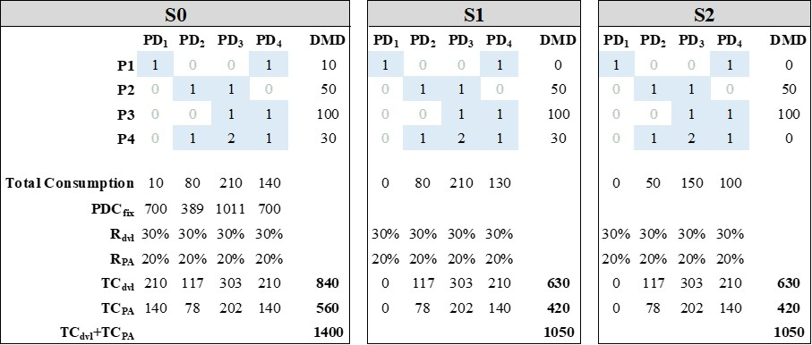

```{r, include = FALSE}
knitr::opts_chunk$set(
  collapse = TRUE,
  comment = "#>"
)
options(rmarkdown.html_vignette.check_title = FALSE)
```

# Component Overdesign

This vignette visulazes implementation of complexity cost drivers in product development as reported in @Meerschmidt.2024 . The following chunk loads the example EAD and represents the initial domain mapping matrix $DMM_{FD,PD}$.

```{r}
library(EAD)
set.seed(123)
EAD <- smallEAD
EAD$DMM$FD_PD
```

Before the design is overdesigned step by step the initial variable resource unit costs `RCU_direct` are calculated and stored in an output object `res` .

```{r}
## define output object
res <- data.frame(SDC_N=NA,
           TC_var=NA,
           N_PD=NA)

## calculate values for initial design
costs_inital<-clc_PCB(EAD$P$RD,
                   DMD = EAD$DEMAND,
                   RC_direct = EAD$RC$direct,
                   RC_var = rep(0,NCOL(EAD$P$RD)))
res[1,]<-c(EAD$measures$SYSTEM$SDC_n$FD_PD,
           sum(costs_inital$PC_B * EAD$DEMAND),
           EAD$measures$SYSTEM$N_PD)
```

The increase of material costs due to overdesign modeled as follows. Starting with a given $DMM_{FD,PD}$ matrix, two components are substituted by one oversized one. The replacement works as follows. First a component is randomly selected, its nearest neighbor component is calculated and selected as a component to be substituted. It is possible to select the second component also by random chance, however, the nearest neighbor search ensures that these two components share some similarities. This reflects more practical settings since it is more likely that engineering, for example, standardizes a small and large beam instead of a small beam and a cabinet. The procedure is repeated as long as there is only one component left. The following chunk visualizes the procedure.

```{r}
i<-2
while(sum(colSums(EAD$DMM$FD_PD)>0)>1){
  EAD<-overdesign_EAD(EAD)$EAD
  message(paste0("\nDMM_FD_PD at step S",i-1))
  print(EAD$DMM$FD_PD)
  res[i,]<-c(EAD$measures$SYSTEM$SDC_n$FD_PD,
           sum(clc_PCB(EAD$P$RD,
                   DMD = EAD$DEMAND,
                   RCU_direct = costs_inital$RCU_direct,
                   RC_var = rep(0,NCOL(EAD$P$RD)))$PC_B * EAD$DEMAND),
           EAD$measures$SYSTEM$N_PD)
  i <- i+1
}
```

See the results:

```{r}
print(res)
```

However, @Eynan.1996 note that for two components $PD_{1}$ and $PD_{2}$ replaced by an overdesigned one$PD_{*}$ the following equation is true

$$C(PD_*)\geq max(C(PD_1);C(PD_2))$$ where $C(PD)$ are the variable costs of a component. In order to reflect this fact costs are calculated using the following equation:$$C(PD_*) = max(C(PD_1);C(PD_2)) + 
min(C(PD_1);C(PD_2)) * U[lb;ub]
$$

with $U[lb;ub]$ being a uniform distribution within the bounds of $lb$ and $ub$. To use these bounds within the the simulation an additional argument is added to `overdesign_EAD()`.

```{r}
set.seed(123)
EAD <- smallEAD

i<-2
while(sum(colSums(EAD$DMM$FD_PD)>0)>1){
  EAD<-overdesign_EAD(EAD,bounds = c(0.6,1))$EAD
  message(paste0("\nDMM_PD_PrD at step S",i-1))
  print(EAD$DMM$PD_PrD)
  res[i,]<-c(EAD$measures$SYSTEM$SDC_n$FD_PD,
           sum(clc_PCB(EAD$P$RD,
                   DMD = EAD$DEMAND,
                   RCU_direct = costs_inital$RCU_direct,
                   RC_var = rep(0,NCOL(EAD$P$RD)))$PC_B * EAD$DEMAND),
           EAD$measures$SYSTEM$N_PD)
  i <- i+1
}
```

The new results are now:

```{r}
res
```

# Development Costs

Literature reports that both, increasing commonality and decreasing product variety decreases development costs. The commonality driven effect, however, is not straightforward. Unifying two individual components removes a prior existing interface between both components which has a reducing effect on development costs. On the other hand, integrating more functional requirements into one component requires more time and, thus, increases development costs. This model assumes that the development costs of $PD_{*}$ are the sum of development costs for $PD_{1}$ and $PD_{2}$. Therefore, the changes in commonality have no impact on development costs. Nevertheless, the impact model nodes product variety as a second driver influencing the development costs which is represented by this model.

If firms decide to restrict the free combination of functional requirements and, therefore, offer only a small proportion of their theoretical possible variety, some components are not used. The following figure show three product mixes represent in the physical domain ($P_{PD}$ ). While the first product mix (S0) contains four products, the number of products is reduced to three in S1 and two for S2. In this example it is further assumed that the initial development costs are \$R\_{dvl}=30

%\$ of component's fix costs. The example shows that as long as a component is used by at least one product, costs for its development ($TC_{dvl}$) occur. Since $PD_{1}$ is used exclusively by product $P_{1}$, the development costs decrease from S0 to S1 $TC_{dvl,S0}=840$ vs. $TC_{dvl,S0}=630$. In another scenario (S2) product $P_{4}$ is excluded. Fixed costs, however, do not decrease further since $P_{4}$ uses components which are still required by other products within the product mix.

{width="500"}

In order to calculate this driver within the framework the following procedure of `development_costs()` function is performed.

```{r}
require(EAD)
## load the example
EAD <- smallEAD
P_PD <- EAD$P$PD
DEMAND<-c(0,50,100,30)
PDC_fix<-c(700,389,1011,700)
R_dvl<-0.3
R_PA<-0.2


## calculate the total component consumption TCC
TCC <- as.numeric(DEMAND %*% P_PD)
non_zero <- as.numeric(TCC > 0)
TC_dvl <- PDC_fix * R_dvl * non_zero

sum(TC_dvl)
```

# Part Management

Modelling of part management costs follow the same logic as the development costs. Again, the commonality caused sub-effect is neglected by using the same argumentation such as for the development costs. Although, commonality reduces the material numbers, overdesigned components fulfill more requirements at ones and are more likely to be affected by external or internal changes. Instead, this model focus on the product variety effect which is modeled analog to the development cost effect.

```{r}
TCC <- as.numeric(DEMAND %*% P_PD)
non_zero <- as.numeric(TCC > 0)
TC_PA <- PDC_fix * R_PA * non_zero

sum(TC_PA)
```

# References
