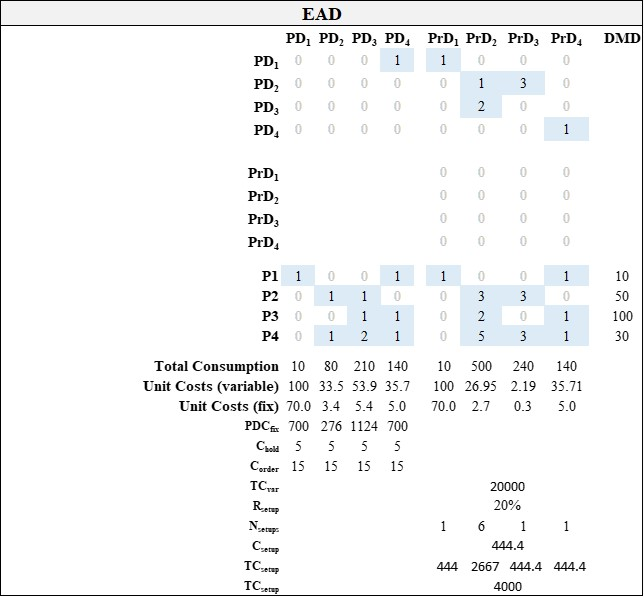

```{r setup, include = FALSE}
knitr::opts_chunk$set(
  collapse = TRUE,
  comment = "#>"
)
options(rmarkdown.html_vignette.check_title = FALSE)
```

This vignette provides an example for the calculation of setup costs and order purchasing costs as introduced in @Meerschmidt.2024. The model unifies the model of @Thonemann.2000 as well as the model of @Zhang.2020. Starting point for this example is the following EAD design. The functional and resource domain are not shown as they are not relevant.

{width="500"}

The EAD design can be created by calling

```{r initialize}
require(EAD)
P_PD <- matrix(c(1,0,0,1,
                 0,1,1,0,
                 0,0,1,1,
                 0,1,2,1),byrow=T,nrow=4)
PD_PrD <- matrix(c(1,0,0,0,
                 0,1,1,0,
                 0,2,1,0,
                 0,0,0,1),byrow=T,nrow=4)
PrD <- diag(0,4)
DEMAND <- c(10,50,100,30)
C_hold <- rep(5,4)
C_order <- rep(15,4)
C_setup <- 444.4
PD_PrD
```

# Setup Costs

In a first step the component demand is calculated.

```{r}
DMD_component <- as.numeric(DEMAND %*% P_PD)
DMD_component
```

Second, the process consumption for each component is calculated

```{r}
DMD_PD <- PD_PrD + PD_PrD %*% PrD
DMD_PD[DMD_PD>0] <- 1
DMD_PD <- DMD_PD * DMD_component
DMD_PD
```

We then calculate the lot sizes by using the Economic Order Quantity model (e.g., @Nahmias.2011). `LZM` hold the lot sizes for each component (rows) and processes (columns).

```{r}
C_order <- sapply(1:NROW(DMD_PD),function(x) C_order)
C_hold <- sapply(1:NROW(DMD_PD),function(x) C_hold)

LZM <- sqrt(2*DMD_PD * C_order / C_hold)

LZM
```

In a fourth step, the tasks are calculated. The tasks describe how many lots need to be produced in order to fulfill the requested demand.

```{r}
TM <- ceiling(DMD_PD / LZM)
TM[is.nan(TM)] <- 0
TM

message("Total number of tasks")
sum(TM)
```

These tasks are executed in a certain order. There are several scheduling methods. However, the model assumes a random processing order. The execution `execution` list hold these information. According to the model of @Zhang.2020, setup occur if and only if the current setup differs from the predecessors' setup.

```{r}
set.seed(1234)
execution <- apply(TM,2,function(x){
  idx <- which(x!=0)
  execution <- unlist(sapply(idx,function(y) rep(y,x[y])))
  execution <- execution[sample(1:length(execution))]
  return(execution)
})

## print the execution order
message("Execution Order")
execution
## plus one is added since there is an initial setup
n_setups <-sapply(execution,function(x) sum(diff(x) != 0)+1)

message("Setups")
n_setups
```

Finally, the setup costs are calculated. In doing so, the average costs for a single setup `C_setup` are multiplied with the number of setups

```{r}
sum(n_setups * C_setup)
```

The entire procedure is included in the function `clc_setupCosts`.

# Tooling Costs

A second manufacturing cost driver are the tooling costs. Authors note an decrease of tooling costs with increasing commonality @Kota2000; @Johnson.2010; @Khajavirad.2007; @Perera.1999 or @Thomas.1992 . According to the model of @Meerschmidt.2024, tooling costs are calculated as follows:

First, the example EAD is loaded and the tooling costs `C_tooling` for each process variant are defined.

```{r}
DEMAND <- c(0,50,100,30)
DMD_component <- as.numeric(DEMAND %*% P_PD)
C_tooling<-matrix(c(5,0,0,0,
                    0,12,14,0,
                    0,10,0,0,
                    0,0,0,7),nrow=4,byrow=T)
sum(C_tooling)
```

It is assumed that tools are required for each combination of component and process so-called process variants. The process variants are calculated as follow where `PVM` holds information which components (rows) go into which processes (columns).

```{r}
PVM <- PD_PrD + PD_PrD %*% PrD
PVM
```

Each non-zero entry in `PVM` represents a process variant for which tooling is required. By dropping unused process variants which are not needed under the current product mix are set to zero.

```{r}
PVM[DMD_component==0,] <- 0
C_tooling[PVM==0] <- 0
C_tooling
```

The total tooling costs are than given as:

```{r}
sum(C_tooling)
```

The number of process variants is calculated as:

```{r}
sum(PVM>0)
```

# References
